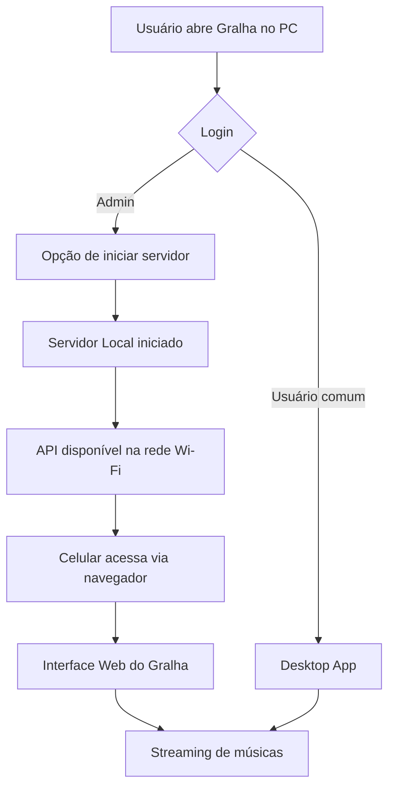

# 📦 Arquitetura do Gralha - Servidor Local + Acesso via Rede Wi-Fi

## 🧠 Resumo da Ideia
Este documento organiza a arquitetura pensada para o projeto **Gralha**, um sistema de gerenciamento de músicas com foco em uso pessoal e em ambientes como estúdios de música.

A proposta principal é:

- Ter um **aplicativo desktop** para uso local no PC
- Ter um **servidor local opcional** rodando na máquina principal
- Permitir acesso às músicas via **navegador no celular conectado à mesma rede Wi-Fi**
- Implementar um sistema de **login e controle de permissões (usuário e admin)**

O objetivo é criar um sistema simples, escalável e com boas práticas de arquitetura de software.

---

## 💡 Insights que levaram à solução

Durante a concepção do sistema, surgiram alguns pontos importantes:

- Evitar complexidade de cloud e exposição de IP público
- Manter o sistema funcional 100% offline dentro da rede local
- Separar responsabilidades entre interface, servidor e lógica de negócio
- Permitir expansão futura sem reescrever o sistema inteiro
- Criar uma experiência similar a um “Spotify local de estúdio”

---

## 🧱 Arquitetura Geral do Sistema

O sistema será dividido em três partes principais:

### 🖥️ 1. Aplicação Desktop
- Interface principal do usuário no PC
- Acesso direto às músicas locais
- Comunicação com o backend interno
- Uso principal do sistema

---

### 🌐 2. Servidor Local (Backend)
- Responsável pela lógica do sistema
- Gerencia músicas, playlists e usuários
- Expõe API para a rede local (Wi-Fi)
- Só pode ser ativado por usuário administrador

---

### 📱 3. Interface Web (Celular)
- Interface acessada via navegador
- Conecta-se ao servidor local via IP da rede
- Permite navegar e tocar músicas remotamente
- Não exige instalação no celular

---

## 🔐 Sistema de Autenticação

O sistema contará com dois níveis de acesso:

### 👤 Usuário padrão
- Acesso ao aplicativo desktop
- Uso básico do sistema
- Sem permissões administrativas

### 👑 Administrador
- Pode iniciar o servidor local
- Pode controlar acesso à rede
- Gerencia permissões do sistema

As senhas serão armazenadas com boas práticas (hash), evitando armazenamento em texto puro.

---

## 🔄 Fluxo de Funcionamento (Fluxograma)

---

## ⚙️ Boas Práticas Aplicadas

### 🔹 Separação de responsabilidades
- Interface (Desktop/Web)
- Backend (API/Servidor)
- Lógica de negócio (core do sistema)

---

### 🔹 Arquitetura modular
O sistema será dividido em módulos:

- core/ → regras do sistema
- api/ → servidor local
- desktop/ → interface do PC
- web/ → interface do celular

---

### 🔹 Segurança básica
- Autenticação por login
- Senhas com hash
- Controle de acesso ao servidor
- API protegida dentro da rede local

---

## 🚀 Visão final do sistema

O Gralha se torna um sistema local completo de música:

- Funciona sem internet
- Pode ser usado no PC e no celular
- Permite acesso remoto dentro da rede Wi-Fi
- Possui controle de usuários e permissões
- Mantém arquitetura simples e escalável

---

## 📌 Conclusão

A arquitetura proposta equilibra:

- Simplicidade de desenvolvimento
- Boa organização de código
- Segurança básica para uso local
- Possibilidade de expansão futura

O sistema evolui de um simples gerenciador de música para um **ambiente completo de streaming local**, sem depender de cloud ou serviços externos.

